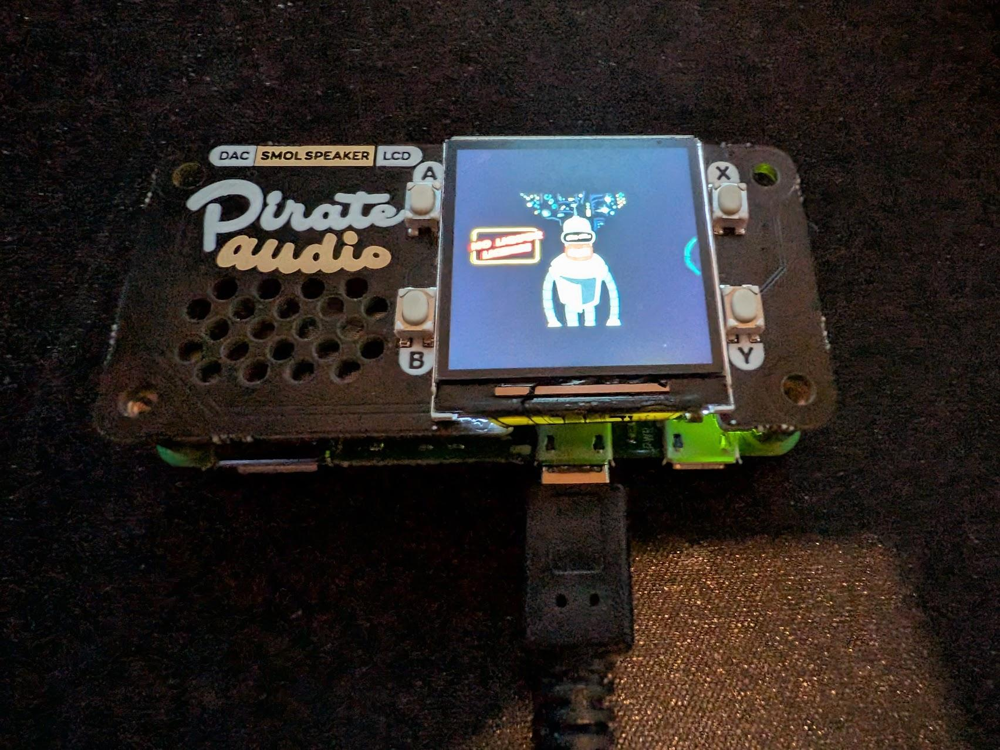

# PITV - Pirate Audio Media Player



A custom Python media player application designed for the Raspberry Pi (specifically tested on Pi Zero W) equipped with a Pimoroni Pirate Audio HAT (or compatible ST7789 display and GPIO buttons).

This application allows you to play video files (audio output via DAC), navigate through Shows and Seasons, and tracks your playback progress so you can resume exactly where you left off.

## Features

- **Media Organization**: Automatically scans for Shows, Seasons, and Episodes.
- **State Persistence**: Remembers current Show, Episode, and playback position (resume on restart).
- **Display Interface**: Shows current playback info (Show, Season, Episode, Time) on the ST7789 screen.
- **Physical Controls**: Mapped to Pirate Audio buttons for easy navigation.
- **Sleep Mode**: Turns off the display backlight to save power while keeping the app running.
- **Audio Control**: Hardware volume control via ALSA/amixer.

## Hardware Requirements

- Raspberry Pi (Zero W, 3, 4, etc.)
- Pimoroni Pirate Audio HAT (with ST7789 display and 4 buttons)
- Speakers/Headphones connected to the HAT

## Prerequisites

Ensure your Raspberry Pi has the necessary system libraries installed:

```bash
sudo apt-get update
sudo apt-get install vlc libvlc-dev alsa-utils
```

*Note: `alsa-utils` is required for volume control via `amixer`.*

## Installation

1. Clone or copy this repository to your Raspberry Pi.
2. Run the installation script to set up system dependencies, Python requirements, and directories:

```bash
chmod +x install.sh
./install.sh
```

Alternatively, you can install manually (using a virtual environment):

```bash
sudo apt-get install vlc libvlc-dev alsa-utils python3-full
python3 -m venv venv
source venv/bin/activate
pip install -r requirements.txt
```

## Media Setup

By default, the application looks for media in `~/media_player_app/media`. You can change this in `config.py`.

**Directory Structure:**
The application expects the following folder structure to correctly identify Shows and Seasons:

```text
/home/pi/media_player_app/media/
├── Show Name A/
│   ├── Season 1/
│   │   ├── s01e01.mp4
│   │   ├── s01e02.mkv
│   │   └── ...
│   └── Season 2/
│       └── ...
└── Show Name B/
    └── ...
```

Supported video formats: `.mp4`, `.mkv`, `.avi` (configurable in `media_manager.py`).

### Media Conversion (Recommended)

To ensure smooth playback on the Raspberry Pi Zero W and the small display, it is recommended to convert your video files to a resolution of 240x240 and a lower frame rate (e.g., 15fps).

A Windows batch script `convert_for_pirate.bat` is included to help with this.

**Using the conversion script:**
1. Ensure you have [FFmpeg](https://ffmpeg.org/download.html) installed and in your system PATH.
2. Drag and drop your video files onto `convert_for_pirate.bat`.
3. The converted files will be saved in a `converted` folder created in the same directory.

## Controls

The buttons are mapped as follows (based on standard Pirate Audio layout):

| Button | Position | Action |
| :--- | :--- | :--- |
| **A** | Top Left | **Short Press:** Previous Episode <br> **Long Press:** Rewind 30s |
| **B** | Top Right | **Short Press:** Next Episode <br> **Long Press:** Fast Forward 30s |
| **X** | Bottom Left | **Short Press:** Toggle Shuffle Mode <br> **Long Press:** Sleep / Wake |
| **Y** | Bottom Right | **Short Press:** Next Show <br> **Long Press:** Rotate Screen (0°, 90°, 180°, 270°) |
| **Y + X** | Combo | **Hold Y, then Press X:** Cycle Volume |

## Configuration

You can customize settings in `config.py`:

- **GPIO Pins**: Adjust `BUTTON_TL`, `BUTTON_TR`, etc., if using custom wiring.
- **Volume Presets**: Modify `VOLUME_PRESETS` list.
- **Paths**: Change `MEDIA_ROOT_DIR` or `STATE_FILE_PATH`.
- **Timeouts**: Adjust long-press duration or screen dimming timers.

## Usage

Start the player using the provided helper script:

```bash
./run.sh
```

Or manually activate the virtual environment and run:

```bash
source venv/bin/activate
python3 main.py
```

## Start on Boot

To run the player automatically when the Pi turns on, run the setup script:

```bash
chmod +x setup_autostart.sh
./setup_autostart.sh
```

**Managing the Service:**
*   **Stop:** `sudo systemctl stop pitv.service`
*   **Start:** `sudo systemctl start pitv.service`
*   **Check Logs:** `sudo journalctl -u pitv.service -f`

To run automatically on startup, consider adding a systemd service or a crontab entry.

## Troubleshooting

- **Display not working**: Ensure SPI is enabled in `sudo raspi-config`.
- **No Audio**: Check your ALSA configuration (`/boot/config.txt`) to ensure the DAC is enabled (e.g., `dtoverlay=hifiberry-dac`).
- **Permission Errors**: Ensure the user running the script has permissions to read the media directory and write to the state file.

## Roadmap

Future features and enhancements planned for PITV:

### 1. Visual & UI Enhancements
- [ ] **Cover Art Support**: Display `poster.jpg` or `folder.jpg` from Show/Season directories.
- [ ] **Visual Progress Bar**: Slim progress bar at the bottom of the screen.
- [ ] **"TV Guide" / Menu Mode**: Visual list navigation for Shows/Episodes (e.g., hold A+B to enter).

### 2. Advanced Playback Features
- [x] **"Shuffle / Channel Surfing" Mode**: Randomly play episodes from any show.
- [ ] **Resume-Per-Show**: Track playback progress individually for each show.
- [ ] **Sleep Timer**: Auto-stop and sleep after a set duration.

### 3. Remote Management
- [ ] **Web Interface**: Control playback via a phone/PC browser.
- [ ] **File Upload Server**: Upload media files via the web interface.
- [ ] **WiFi / IP Status**: Display IP address on the screen for easier connection.

### 4. Hardware Integrations
- [ ] **Battery Status**: Support for PiSugar or UPS HAT battery monitoring.
- [ ] **Bluetooth Audio**: Manager for connecting Bluetooth headphones/speakers.